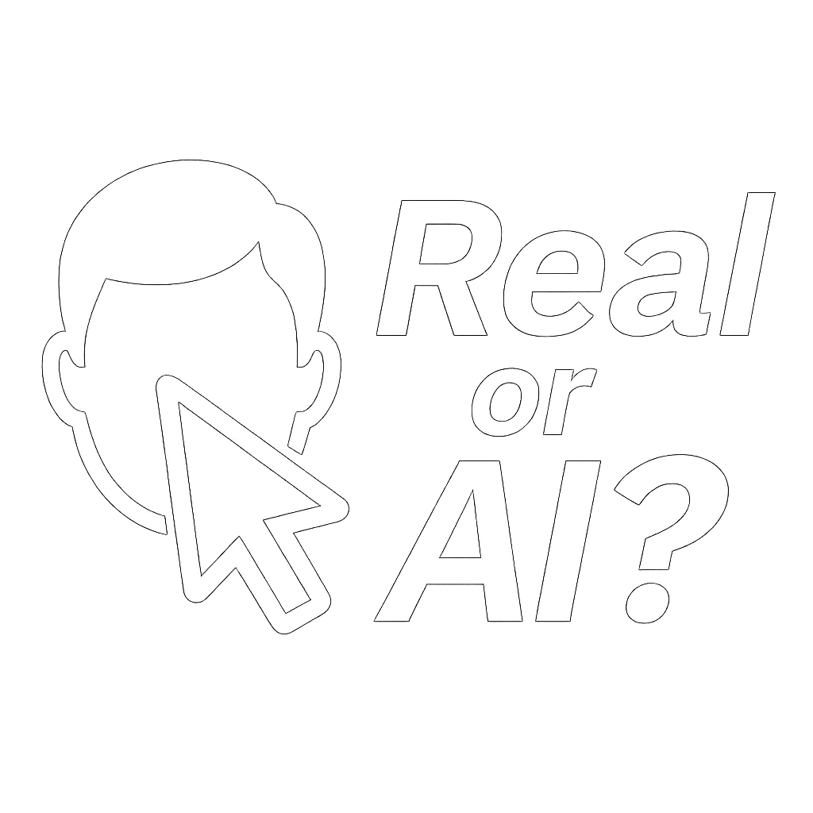

# RealOrAI image dataset

The live experiment is avaiable here: https://adrienpavao.com/RealOrAI

The dataset consists in 60 real images from the [CC12M dataset](https://github.com/google-research-datasets/conceptual-12m), and 60 artificial images generated using [MidJourney](https://www.midjourney.com/) v7. The labels are given by `labels.csv`.

